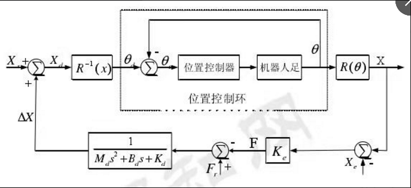
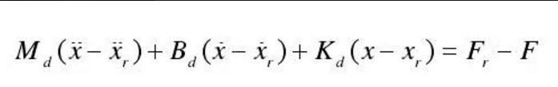

### 1.阻抗控制
****
（保持机器人末端位置与接触力之间的理想动态关系。）
#### 1.1阻抗控制的实现方法
##### 1.1.1基于位置的阻抗控制
  内环为位置控制器，外环为阻抗控制器。内环的位置控制器控制机器人的关节角θ。再通过正运动学，求解出末端位置X，地面的位置为Xe，通过F=X-Xe，得到阻抗控制的力。根据拉氏变换求得△X。由理想输入Xc与△X求得控制输入Xd.
  机器人的控制框图如下所示：
  

  当需要进行力跟踪时，设置参考足力Fr
  
##### 1.1.2基于动力学模型的阻抗控制
基于动力学模型，给出前馈输入。
#### 1.2阻抗控制参数获取
##### 1.2.1自适应方法在线获得
##### 1.2.2神经网络学习获得
##### 1.2.3人工示教数据获得
