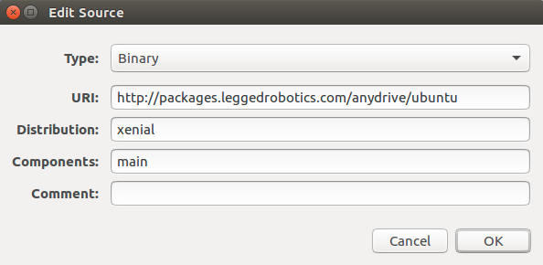

### 1.
****
新建一个文件夹，将kindr、ma27、OOQP、rbdl四个软件包克隆到文件夹。
```
cd
mkdir systemdepend
cd systemdepend
git clone (上面四个)
```
### 2.
****
安装kindir：在kindir文件包里新建build文件夹，进入build文件夹。在此处进入终端，输入“cmake ..”。然后输入“sudo make install”。
```
cd kindir
mkdir build
cd build
cmake ..
sudo make install
```
### 3.
****
安装ma27：进入ma27-1.0.0，在此进入终端，输入“bash ./configure CPPFLAGS=”-fPIC” FFLAGS=”-fPIC””,然后输入“sudo make install”
```
cd ma27/ma27-1.0.0
bash ./configure CPPFLAGS=”-fPIC” FFLAGS=”-fPIC
sudo make install
```
### 4.
****
安装OOQP：进入OOQP，进入终端。输入“MA27LIB=/usr/local/lib/libma27.a”，“export MA27LIB”，“./configure CXXFLAGS=”-fPIC””,“sudo make install”。
```
cd OOQP
MA27LIB=/usr/local/lib/libma27.a
export MA27LIB
./configure CXXFLAGS="-fPIC"
sudo make install
```
### 5.
****
安装RBDL：在安装之前，先将CmakeList.txt中第60行的urdf reader 后的OFF改成ON。”mkdir build”, then “cd build”, ”cmake -D CMAKE_BUILD_TYPE=Release RBDL_BUILD_ADDON_URDFREADER=TRUE ../”, then “sudo make install”.	”cd usr/local/lib/cmake” 若没有cmake文件夹，则自己创建文件。执行“sudo mkdir rbdl”。再执行	“sudo cp RBDLConfig.cmake /usr/local/lib/cmake/rbdl”。
```
cd rbdl
gedit CMakeLists.txt  //修改OFF为ON
mkdir build
cd build
cmake -D CMAKE_BUILD_TYPE=Release RBDL_BUILD_ADDON_URDFREADER=TRUE ../
sudo make install
cd usr/local/lib
sudo mkdir cmake
cd usr/local/lib/cmake
sudo mkdir rbdl
sudo cp RBDLConfig.cmake /usr/local/lib/cmake/rbdl
```
###6.
****
安装ros_ethercat:
首先将ros_ethercat包克隆到/catkin_ws/src文件夹。
然后打开Ubuntu系统设置，在“软件和更新”中选择“其他软件”添加卷如图所示


然后运行
```
sudo apt-get install ros-kinetic-soem
```
### 7.
****
将grip_map、simple_dog_simulation、others、quadruped_locomotion、四个文件克隆到自己的工作空间的src文件夹中。
```
git clone (四个主文件)
sudo apt-get install libgoogle-glog-dev
rqt --force-discover
cd ..
catkin_make -DCATKIN_WHITELIST_PACKAGES="free_gait_msgs"
catkin_make -DCATKIN_WHITELIST_PACKAGES="sim_assiants"
catkin_make -DCATKIN_WHITELIST_PACKAGES=""
```
