#### 作者所用理论/模型
  基于投影的分层任务空间逆动力学框架
  prioritized least square optimization
  并行任务执行（移动足端、保持姿态、优化关节力矩...）
  静态优化：能量效率、抗滑稳定性、
  高柔性串联弹性驱动器
  Precise torque and position controllability
#### 背景
##### 1.1本体：
  目前的液压驱动，具有高输出刚度特性。这些执行机构固有安全特性非常差。
  SEA（串联柔性驱动）适合与环境和人类的交互，但是在控制方面，固有柔性对精确控制不利。控制系统带宽显著降低（由于机械低通滤波）。
##### 1.2控制：
* 传统的位置控制不能适应环境，而力矩控制不仅可以适应环境，而且可以通过合理分配关节力矩和足端力矩来提高动态稳定性。
###### 1.2.1运动生成
* deals with general concepts to create the behavior of the system，no final realization.
  数值优化。
  实时控制的预测策略。
  神经学和生物学的理论，如CPG。
###### 1.2.2运动控制
* transfers the
desired behavior into high-level actuator commands such as joint torque or position demand signals.
  虚拟模型控制VMC。作用在物体上的虚拟力分布到不同的接触点，然后映射到各个关节扭矩。
  控制操作空间（OSC）：Using different control gains and priorities, it can be ensured that important or high precision   
   tasks are accurately executed while other less important tasks are only fulfilled as well as possible without impairing the ones with higher priority.
###### 1.2.3关节控制
* regulates each joint independently.
  对于传统的大减速比的执行器，由于摩擦和齿轮间隙，难以建模和补偿。（使用干扰观测器来补偿）
#### 大纲
  多基体的浮动基座建模；处理接触限制和碰撞；系统动力学的解析表示。
  硬件、实时仿真系统
  控制高柔顺的SEA，有优秀的力位控制表现。
  分层二次优化，分层控制，设置不同的优先级

#### 系统建模
  MBS（multi-body systems）多刚体系统；
  EOM（equations of motion）：处理足端接触约束和由此产生的反力-->运动平衡方程。
  处理接触状态的瞬时变化、冲击、能量损失。    
  运动平衡方程：
  
##### 1接触模型
##### 1.1柔性接触
  弹簧阻尼腿，接触力和刚度与阻尼的大小有关，也就和速度、位置有关
  
##### 1.2刚性接触
  

##### 2 动力学约束
*
###### 2.1 投影
###### 2.2 投影矩阵的QR分解
###### 2.3 最小坐标系
  将广义坐标转为最小坐标系。
###### 2.4 接触转换与碰撞
能量损失：动能损失
###### 2.5 解析表示
用牛顿欧拉法求运动平衡方程。

##### 3 系统设计
  X构型适合四足机器人。在链条上设置一个破坏点，使之为最弱点，一旦机器人发生破坏，即为链条破坏，易于更换、成本低。

##### 4 底层的SEA单元控制
* 电机内部的电流、速度环与外部的SEA控制框架级联。    
* ＰＩ反馈回路与扰动前馈补偿（关节力矩控制）。
* ＬＱＲ控制框架（摆动腿的位置控制）
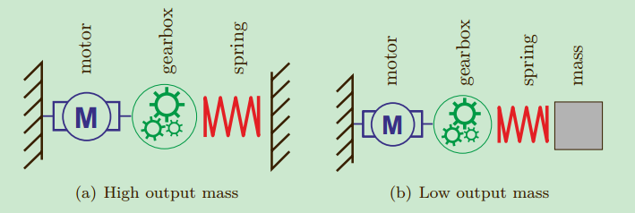
两种模式：１支撑　２摆动
（阻尼困局：摆动腿需要较大阻尼以消除震荡；支撑腿需要较小阻尼以减少能量损耗）
###### 4.1控制框架
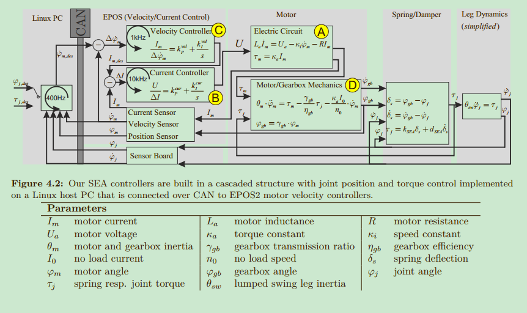
###### 4.2关节力控
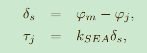
弹簧挠度＝齿轮减速箱转角－关节转角　
弹簧反馈的关节转矩＝Ｋ*弹簧挠度
###### 4.2.1 关节力控
1.PI反馈：
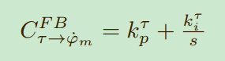
2.速度前馈补偿
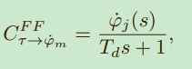
###### 4.3关节位控
LQR控制（线性二次调节）
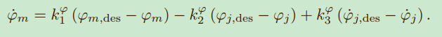
##### 5 基于模型的运动控制
基于运动学和动力学信息，发送力矩命令．
###### 5.1 广义虚拟模型控制
通过关节力矩模拟外力作用在支撑点上．
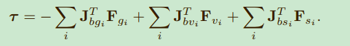
###### 5.2　浮动基座的逆动力学
###### 5.3　分层二次优化
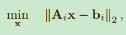
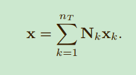
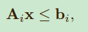
1.运动优化
最小化任务加速度
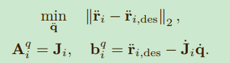
2.力／力矩优化
##### 6运动生成
###### 6.1倒立摆模型
在支撑相，
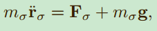
 如果xk = xk+1，则称为周期稳定．
* 无差拍控制
寻找在最短的时间内，让输出进入稳定的输入信号．
在Ｎ阶线性系统中，0可控系统（利用输入使得状态变0）的最少步数不会超过Ｎ．
###### 6.2动态步态
