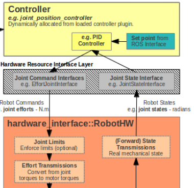
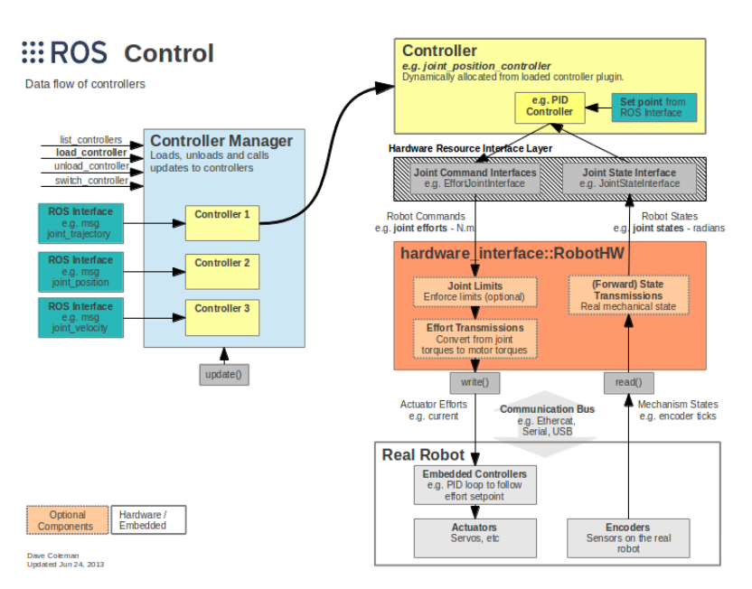

### Ros_control
****
输入：　　　
  1.机器人编码器的关节状态　　　
  2.输入设置点　　　

* 硬件资源接口层
　关节命令接口：接受controller的输入
　关节状态接口：接受机器人关节状态的输入


* 硬件接口层　　
接受资源层的命令并将其写入到真实的机器人上．
读取机器人的状态，并将其发送到资源层的接口．　　　

* 数据流图

****
####创建一个控制器
首先，从controller_interface继承Controller类。并从中继承init() starting() update() stopping()四个函数。
重载４个函数．
在源代码末尾加上
```
PLUGINLIB_DECLARE_CLASS(my_controller_pkg,MyControllerPlugin,
                         my_controller_ns::MyControllerClass,
                         pr2_controller_interface::Controller)
```
第一个参数：包名称　　　
第二个参数：控制器插件名称（在相应的controller_plugins.xml中定义）
第三个参数：所写的Controller类名称
第四个参数：基类名称　　　

controller_plugins.xml文件格式：
```
<library path="lib/libmy_controller_lib">
  <class>
    name="MycontrollerPlugin"
    type="xray_ns::XrayController"
    base_class_type=""pr2_controller_interface::Controller"
  </class>
</library>
```
写一个yaml文件,格式大致如下所示。
```
my_controller_name:
  type: my_controller/MycontrollerPlugin
  joint_name: r_shoulder_pan_joint
  pid_parameters:
    p:10.0
    i:0.0
    d:0.0
    i_clamp:0.0

```
写一个launch文件：
```
<launch>
   <rosparam file="$(find my_controller_pkg)/my_controller.yaml" command="load" />

   <node pkg="pr2_controller_manager" type="spawner" args="my_controller_name" name="my_controller_spawner" />
</launch>
```
