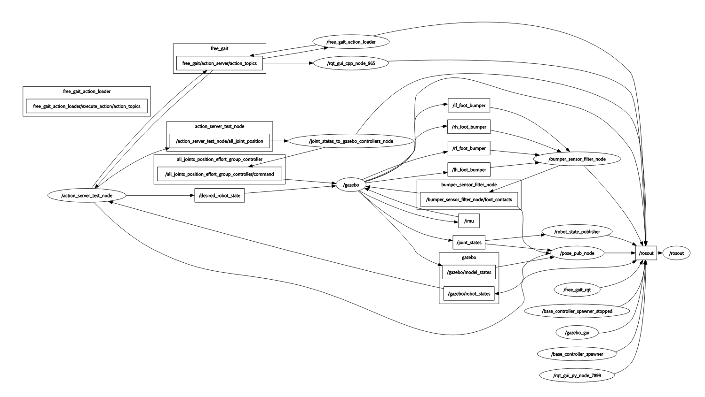

#### 1
**********
fake_pose_pub.cpp/h 定义类FakePose，完成gazebo关节的读取，并将其发布出来。
节点名：/pose_pub_node
订阅了gazebo模型状态、关节状态、足端传感器信息。发布robot_state_。
#### 2
**********
fake_pose_node 使用FakePose的节点

#### 3
**************
joint_state_to_gazebo 完成了关节角的初始化，并读取位置控制指令。发布关节位置（给gazebo——controler）。

节点名：joint_command_interface。
定义多维数组joint_group_positions，将从topic：/action_server_test_node/all_joint_position
  （该topic由action_server_test_node发出，而发出节点又会订阅/cmd或free_gait/action_server/action_topic消息）订阅到的传感器消息传入数组。
将joint_group_positions接受到的消息发布到topic：/all_joints_position_effort_group_controller/command，而gazebo节点会订阅这个topic。
#### 4
***********
bumper_sensor_filter

节点名：bumper_sensor_filter_node
定义了类BumperSensorFilter。 构造函数中
footstate_足端状态。
订阅了四个足端传感器的topic，将内容发布到/bumper_sensor_filter_node/foot_contacts的topic上。

